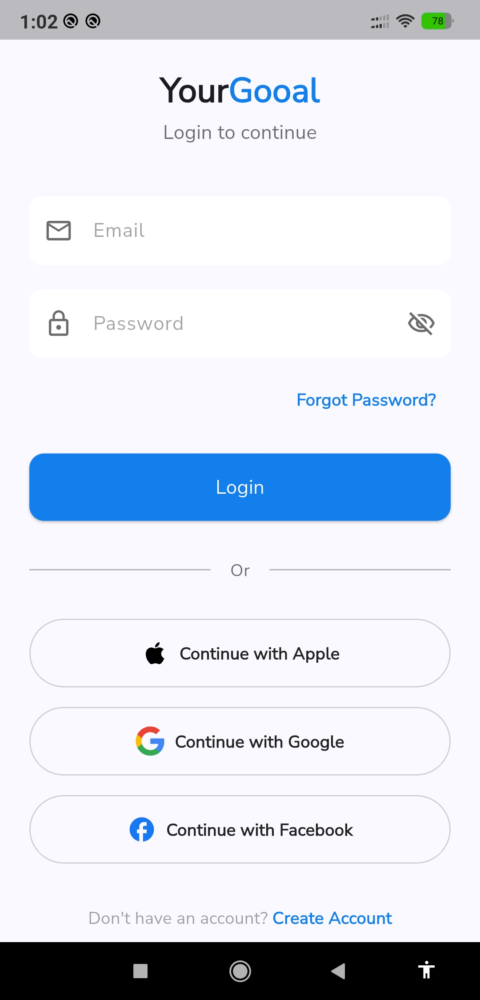
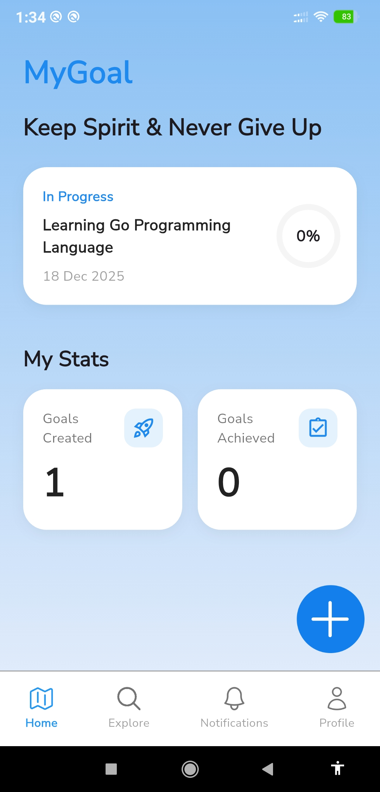
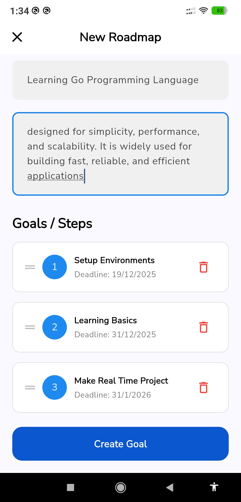
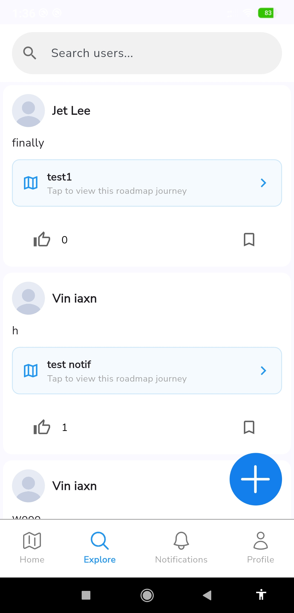
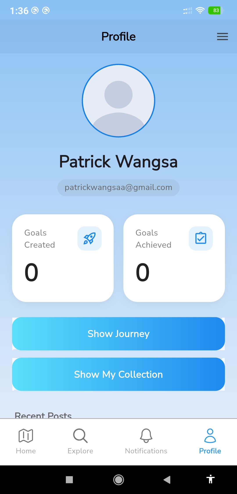
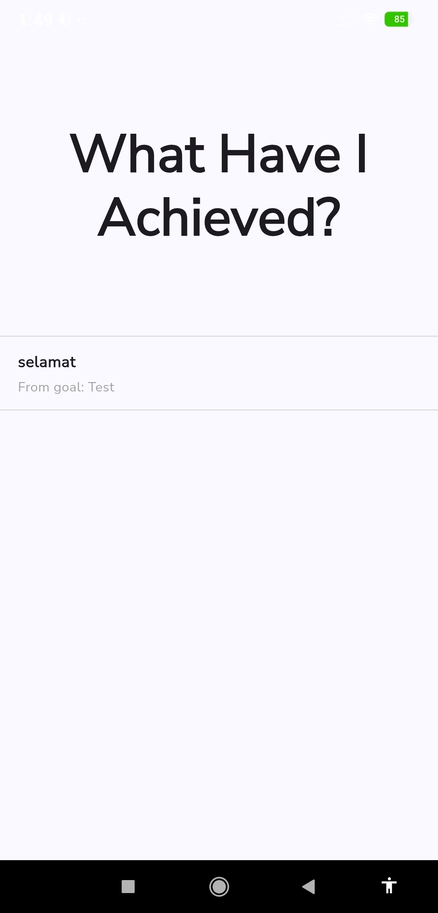
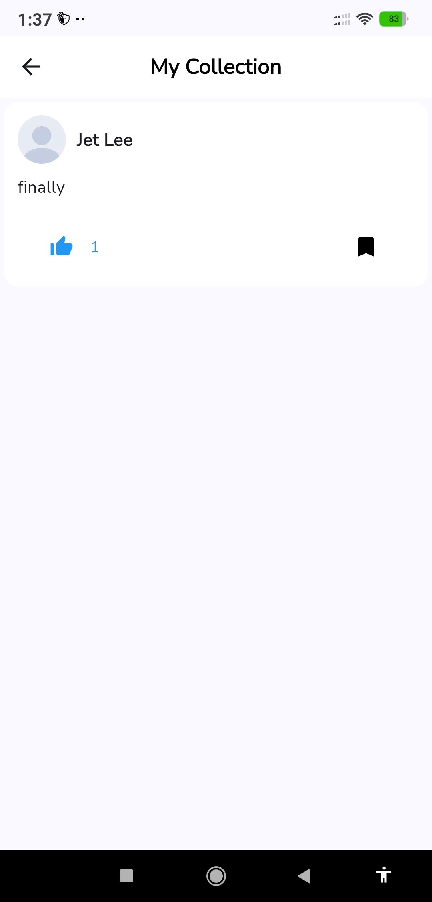
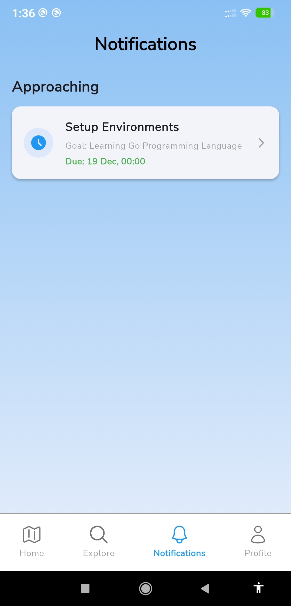
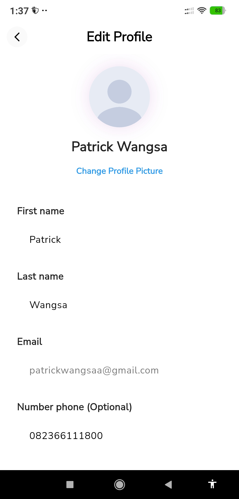

# YourGoal 🚀

**YourGoal** adalah aplikasi mobile interaktif yang dirancang untuk membantu pengguna merencanakan hidup, menetapkan target impian, dan memantau perkembangan diri melalui pembuatan **Roadmap** yang terstruktur. Aplikasi ini juga dilengkapi dengan fitur sosial untuk saling berbagi pencapaian dan motivasi.

> **Final Project Pemrograman Mobile - Semester Ganjil T.A. 2025/2026** > Fakultas Ilmu Komputer dan Teknologi Informasi, Universitas Sumatera Utara

---

## 👥 Anggota Kelompok

| NIM | Nama | Role |
| :--- | :--- | :--- |
| **231401059** | **Steven Girsang** | Developer |
| **231401065** | **Kevin Lubis** | Developer |
| **231401071** | **Patrick Nathan** | Developer |

---

## 📥 Download Aplikasi & Dokumen

Berikut adalah link penting untuk pengumpulan Final Project ini:

### 📱 File Aplikasi (APK)
- **GitHub Release (Recommended):** [🔗 Klik disini untuk Download APK](LINK_GITHUB_RELEASE_ANDA_DISINI)
- **Google Drive (Mirror):** [🔗 Link Google Drive](https://drive.google.com/drive/folders/1l9mEOJ40mfsPBKB9n-qtS-P-zXvodye_?usp=sharing)

### 📂 Dokumentasi Proyek (SRS)
- **Dokumen SRS:** [🔗 Klik disini untuk melihat Dokumen SRS](https://drive.google.com/drive/folders/1l9mEOJ40mfsPBKB9n-qtS-P-zXvodye_?usp=sharing)

---

## 📱 Tentang Aplikasi

**YourGoal** dibangun untuk mengatasi kesulitan pengguna dalam memanajemen tujuan hidup. Aplikasi ini tidak hanya sekedar *To-Do List*, melainkan sebuah ekosistem dimana pengguna dapat:
1.  **Merancang Roadmap:** Memecah tujuan besar menjadi langkah-langkah kecil (Steps) dengan tenggat waktu yang jelas.
2.  **Social Engagement:** Berbagi progres, melihat postingan pengguna lain, memberikan *Like*, dan menyimpan postingan inspiratif (*Bookmark*).
3.  **Self-Tracking:** Memantau statistik pencapaian dan melihat riwayat perjalanan (*Journey*) pengguna.

### 🛠️ Tech Stack
* **Framework:** Flutter (Dart)
* **Authentication:** Firebase Auth (Email & Password)
* **Database:** Cloud Firestore
* **Storage:** Firebase Storage (Profile Pictures)
* **State Management:** `setState` & Streams

---

## ✨ Fitur Utama

### 1. Authentication System
* **Login & Register:** Pengguna dapat mendaftar dan masuk menggunakan email/password.
* **Social Login:** Opsi login cepat menggunakan akun Google, Apple, dan Facebook.
* **Email Verification:** Sistem verifikasi email sebelum login untuk keamanan akun.
* **Forgot Password:** Fitur pemulihan kata sandi jika pengguna lupa.
* **Profile Management:** Edit foto profil, nama depan, nama belakang, dan nomor telepon.

### 2. Roadmap & Goal Management
* **Create Roadmap:** Membuat target baru dengan judul, deskripsi, dan waktu target.
* **Step Tracking:** Menambahkan langkah-langkah (Steps) mendetail dengan deadline spesifik.
* **Progress Monitoring:** Melihat persentase penyelesaian roadmap secara *real-time*.
* **Notification:** Pengingat otomatis untuk deadline yang semakin dekat.

### 3. Social & Explore (Jejaring Sosial)
* **Post Creation:** Pengguna dapat membagikan pemikiran atau update progress mereka.
* **Explore Page:** Mencari pengguna lain (Search User) dan melihat postingan komunitas.
* **Interactions:** Memberikan *Like* pada postingan teman.
* **Collections:** Menyimpan (*Bookmark*) postingan menarik ke dalam koleksi pribadi.

### 4. Journey & Analytics
* **User Journey:** Linimasa otomatis yang mencatat setiap *milestone* atau langkah yang telah diselesaikan.
* **Statistics:** Tampilan grafis sederhana mengenai jumlah *Goals Created* vs *Goals Achieved*.

---

## 📸 Tangkapan Layar (Screenshots)

Berikut adalah tampilan antarmuka utama aplikasi YourGoal:

| Login Page | Dashboard / Home | Create Roadmap |
|:---:|:---:|:---:|
|  |  |  |

| Explore & Search | Profile Page | User Journey |
|:---:|:---:|:---:|
|  |  |  |

| Collections | Notifications | Edit Profile |
|:---:|:---:|:---:|
|  |  |  |

---

## 🚀 Cara Instalasi (Source Code)

Jika Anda ingin menjalankan *source code* ini di mesin lokal:

1.  **Clone Repository**
    ```bash
    git clone [https://github.com/SILVERGOLDZ/YourGoal.git](https://github.com/SILVERGOLDZ/YourGoal.git)
    cd YourGoal
    ```

2.  **Install Dependencies**
    ```bash
    flutter pub get
    ```

3.  **Setup Firebase**
    * Pastikan file `google-services.json` (Android) dan `GoogleService-Info.plist` (iOS) sudah ditempatkan di folder yang sesuai jika Anda menggunakan konfigurasi Firebase sendiri.

4.  **Run Application**
    ```bash
    flutter run
    ```

---

## ⚠️ Catatan Penting
Aplikasi ini dikembangkan sebagai bagian dari tugas akhir mata kuliah Pemrograman Mobile. Fitur yang tersedia telah disesuaikan dengan **MVP (Minimum Viable Product)** yang direncanakan.

---

© 2025 YourGoal Team - Universitas Sumatera Utara